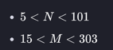

# hackerrank_py_exercises-
I will post my exercises for hackerrank here 
Mr. Vincent works in a door mat manufacturing company. One day, he designed a new door mat with the following specifications:

- Mat size must be X. ( is an odd natural number, and  is  times .)
- The design should have 'WELCOME' written in the center.
- The design pattern should only use |, . and - characters.

**Sample Designs**

    Size: 7 x 21 
    ---------.|.---------
    ------.|..|..|.------
    ---.|..|..|..|..|.---
    -------WELCOME-------
    ---.|..|..|..|..|.---
    ------.|..|..|.------
    ---------.|.---------
    
    Size: 11 x 33
    ---------------.|.---------------
    ------------.|..|..|.------------
    ---------.|..|..|..|..|.---------
    ------.|..|..|..|..|..|..|.------
    ---.|..|..|..|..|..|..|..|..|.---
    -------------WELCOME-------------
    ---.|..|..|..|..|..|..|..|..|.---
    ------.|..|..|..|..|..|..|.------
    ---------.|..|..|..|..|.---------
    ------------.|..|..|.------------
    ---------------.|.---------------


A single line containing the space separated values of  and .

**Constraints**



**Output Format**

Output the design pattern.

**Sample Input**

```
9 27
```

**Sample Output**

        ------------.|.------------
        ---------.|..|..|.---------
        ------.|..|..|..|..|.------
        ---.|..|..|..|..|..|..|.---
        ----------WELCOME----------
        ---.|..|..|..|..|..|..|.---
        ------.|..|..|..|..|.------
        ---------.|..|..|.---------
        ------------.|.------------
